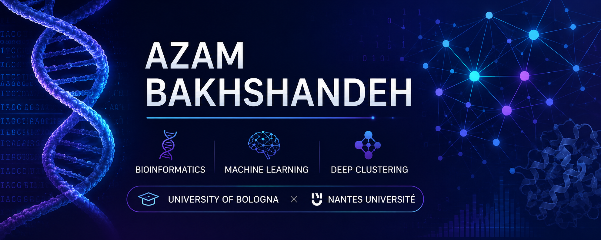

  

  

  

  

  

  

# Hi, I'm Azam Bakhshandeh 👋

### 👩‍💻 About Me

- 🎓 MSc Bioinformatics Student at University of Bologna (Italy)
- 🔬 Master's Thesis Research at Nantes Université (France)
- 🧬 Research interests: Bioinformatics, Machine Learning, Deep Learning
- 🌐 Currently working on Representation Learning and Deep Clustering of Temporal Ego-Networks

## 🎓 Education

**MSc Bioinformatics**
University of Bologna, Italy

**MSc Industrial Engineering (Optimization)**
Amirkabir University of Technology, Iran

## 🔭 Research Interests

  
  
  
  
  
  

## 🚀 Current Thesis

**Analysis of Temporal Ego-Networks Using Representation Learning**

🏛️ LS2N Laboratory — Nantes Université

🧠 **Methods:** Dense AE • Conv1D AE • Conv2D AE • LSTM AE • GRU AE • Transformer AE • KMeans

## 🛠️ Tech Stack

### 💻 Programming

  
  
  

### 🤖 Machine Learning & AI

  
  
  
  
  

### 🧬 Bioinformatics

  
  
  
  

### 🛠️ Development Tools

  
  
  
  
  

## 📌 Featured Projects

### 🧬 Deep Clustering Research
Representation learning and clustering of temporal ego-networks using Autoencoders and KMeans.

### 🎗️ Breast Cancer Classification
Machine learning models for breast cancer prediction using WDBC dataset.

### 🔬 Fluorescent Cell Segmentation
U-Net based deep learning approach for biomedical image segmentation.

### 🧪 Signal Peptide Prediction
Machine learning models for protein signal peptide identification.

## 📚 Publications

* 🥇 First Author — *Multi-objective Scheduling Model in Medical Tourism Centers Considering Multi-task Staff Training*
  
  [🔗 DOI](https://doi.org/10.1016/j.engappai.2023.107808)

* 🤝 Co-author — *Nanovaccines for Cancer Immunotherapy: Focusing on Complex Formation Between Adjuvant and Antigen*
  
  [🔗 DOI](https://doi.org/10.1016/j.intimp.2023.109887)
  

🎓 Complete publication list available on my
[Google Scholar Profile](https://scholar.google.com/citations?user=rB0UiqMAAAAJ&hl=en).

## 📊 GitHub Stats

  

